# Diamond Price Prediction: EDA, Hypothesis Testing and Machine Learning Valuation

End-to-end analytics project in Python that cleans a 55,000-row diamond dataset, tests pricing hypotheses, and builds machine learning models to predict diamond value for a fictional retailer, **Aurora Gems**. The work covers the full pipeline a data analyst owns in practice: data quality remediation, exploratory analysis, statistical inference, regression diagnostics, and predictive modelling, each step tied back to a business decision.

> Academic project completed for BUSA8000 - Techniques in Business Analytics, Master of Business Analytics at Macquarie University. The client, *Aurora Gems*, and the business scenario are fictional; the analysis and code are my own.

---

## Key findings

- **A Random Forest model predicts diamond price within ~15% on average (R² = 0.85)**, clearly outperforming linear regression on the dollar scale by capturing the nonlinear way attributes combine to set price. This is the model recommended for valuation.
- **Carat weight overwhelmingly drives price.** In the regression it carried a t-statistic of 460, while depth had no significant effect once size was controlled. A naive chart suggested the *lowest* cut grade (Fair) commanded the *highest* average price; controlling for carat reversed this, exposing a classic confound where larger stones happen to cluster in lower cut grades.
- **Rigorous data cleaning was the foundation.** The raw file stored numbers as text, hid missing values behind placeholders (`na`, blanks, `0`), carried invalid category codes, and contained duplicate rows. After remediation, hypothesis tests confirmed the average price sits significantly *below* the assumed 3,300 USD benchmark (p = 0.0007), a direct input to pricing strategy.

---

## Skills demonstrated

This project maps to the core responsibilities listed in data analyst job postings:

- **Data cleaning and wrangling**: type coercion, placeholder-to-null conversion, invalid-category handling, deduplication, median imputation
- **Statistical literacy**: distribution and skewness analysis, log / square-root / Box-Cox transformations, one- and two-sample t-tests with correct one- and two-sided framing
- **Regression modelling and diagnostics**: OLS interpretation plus formal assumption checks (normality, homoscedasticity, independence via Durbin-Watson, linearity, multicollinearity via VIF)
- **Machine learning**: Random Forest regression, train/test splitting, and model comparison on held-out data
- **Model evaluation**: RMSE, MAE, MAPE and R² reported on both the transformed and original dollar scales
- **Data visualisation**: matplotlib and seaborn for distributions, relationships, and diagnostics
- **Communicating insight**: every analysis closes with a plain-language recommendation for the business

**Tech stack:** Python, pandas, NumPy, SciPy, statsmodels, scikit-learn, Matplotlib, seaborn

---

## Repository structure

```
diamond-price-prediction/
├── README.md
├── code/
│   ├── diamond_analytics.ipynb   # full analysis notebook (run top to bottom)
│   └── diamond_analytics.py      # script export for quick reading on GitHub
├── figures/                      # all 19 charts referenced below
├── report/
│   └── diamond_analytics_report.pdf   # full written report
└── LICENSE
```

---

## 1. Data cleaning

The raw dataset held 55,843 rows and 10 columns (`carat`, `cut`, `color`, `clarity`, `depth`, `table`, `x`, `y`, `z`, `price`). Several quality issues had to be resolved before any analysis was trustworthy:

- **Mixed data types.** Numeric columns were stored as text, so the file was reloaded with placeholder values (`''`, `' '`, `na`, `null`, `0`) treated as missing, then coerced to numeric.
- **Missing values.** Rows missing a categorical grade (`cut`, `color`, `clarity`) were dropped; remaining numeric gaps were filled with the column median.
- **Duplicates.** 147 fully duplicated rows were removed.
- **Outliers.** Each numeric column was capped using the 1.5 × IQR rule, with out-of-range values replaced by the median.

The boxplots below show the spread of every numeric variable before and after outlier treatment. The wide tails and extreme points on the left are pulled back into sensible ranges on the right.

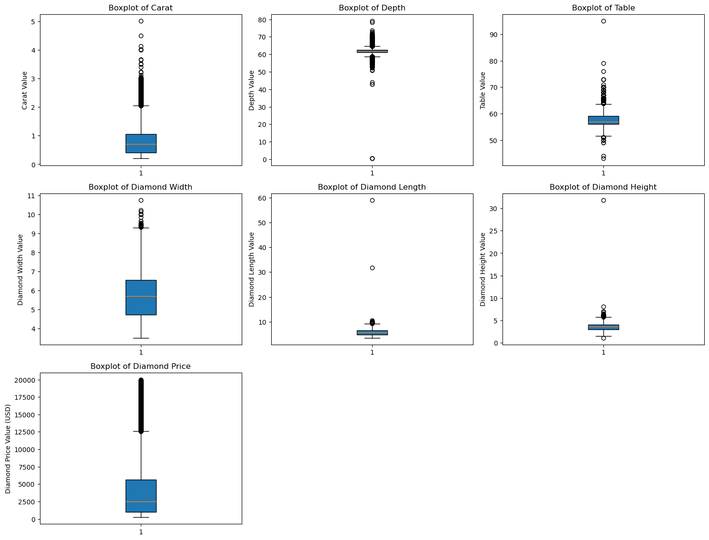
*Before: extreme outliers visible in carat, depth, table and price.*

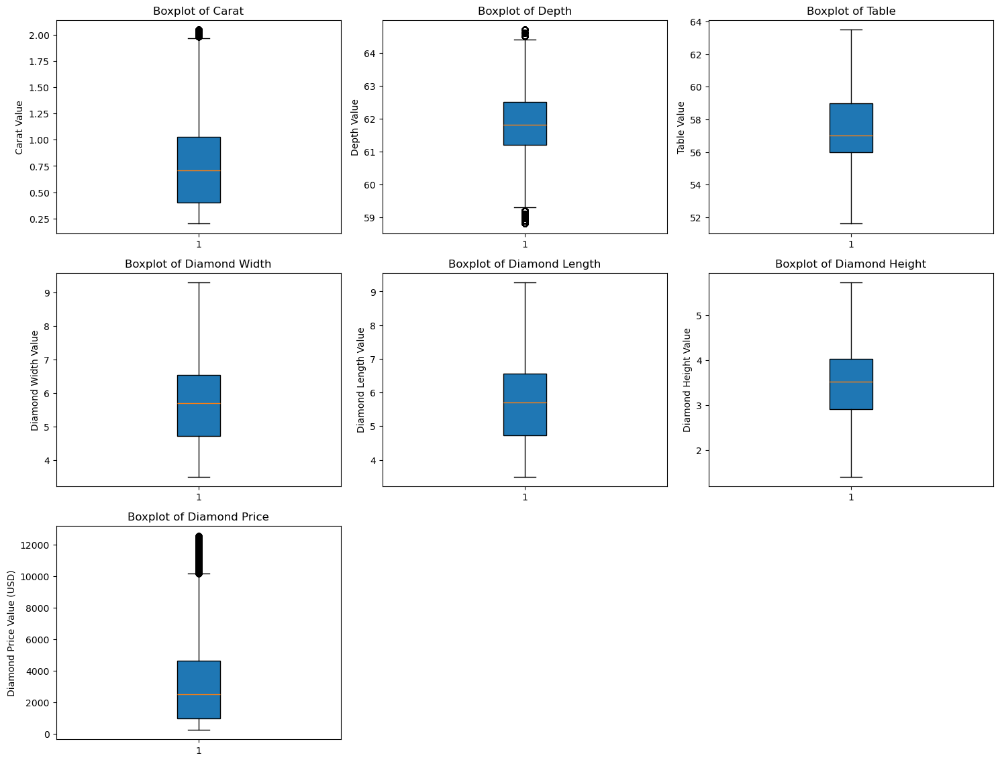
*After: IQR capping has removed the extreme values across all variables.*

---

## 2. Distribution analysis and transformation

With the data clean, each numeric variable's distribution was inspected for skew.

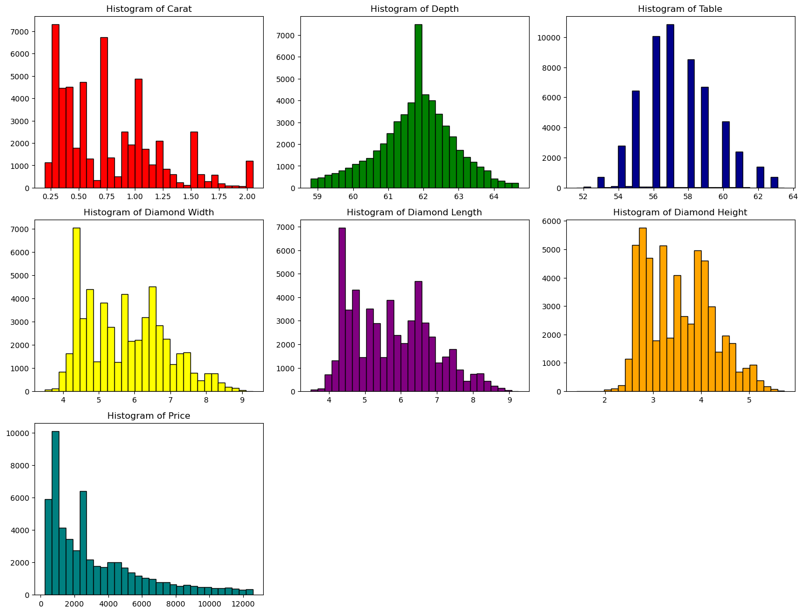
*`carat` and `price` are clearly right-skewed and need transforming before linear modelling.*

Three transformations (log, square root, Box-Cox) were compared for each skewed variable. **Box-Cox produced the most symmetric result in both cases** (final skewness of 0.005 for carat and -0.002 for price), and the price lambda was saved so model predictions could later be inverse-transformed back to USD.

**Carat transformations**

| Log | Square root | Box-Cox (best) |
|-----|-------------|----------------|
| 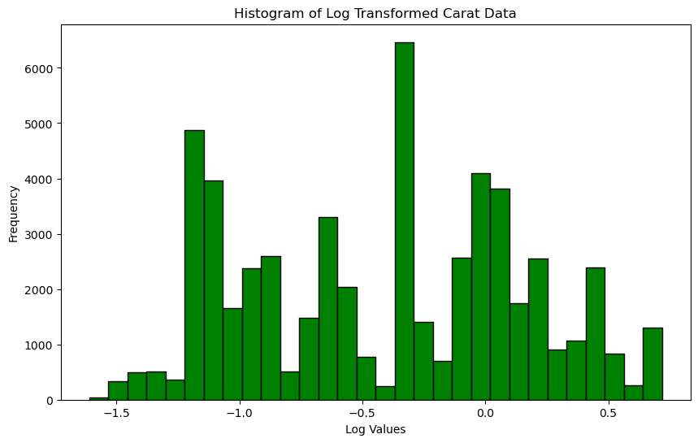 | 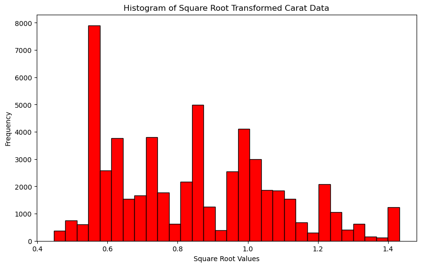 | 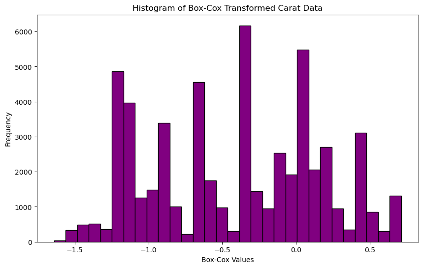 |

**Price transformations**

| Log | Square root | Box-Cox (best) |
|-----|-------------|----------------|
| 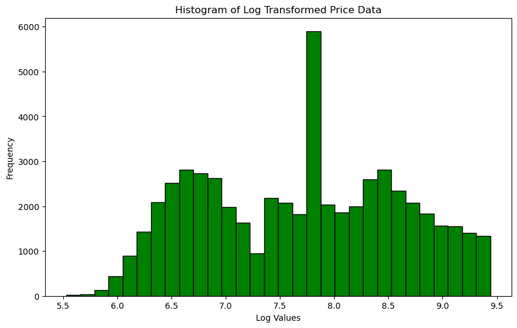 | 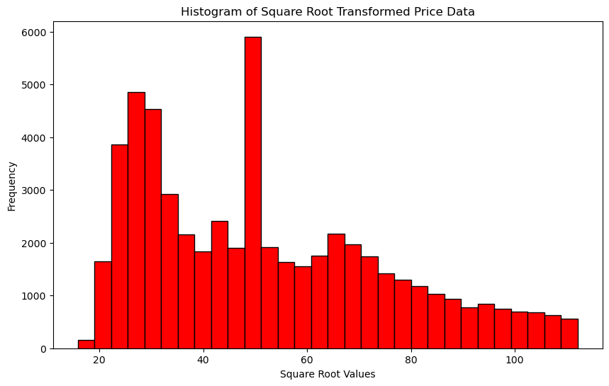 | 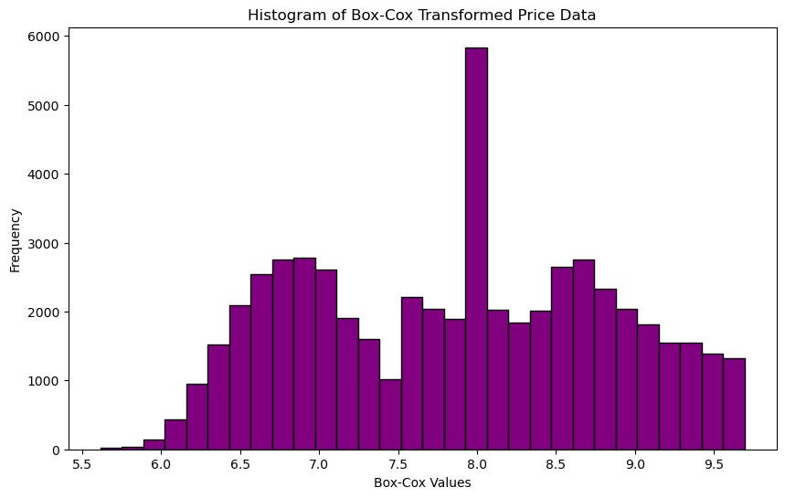 |

---

## 3. Business visualisations

**How does carat weight affect price?** A clear positive relationship, but with wide price spread at every carat level, which tells management that carat alone cannot price a stone. Vertical banding at 1.0, 1.5 and 2.0 carats reflects cutting to land just above psychologically important weight thresholds.

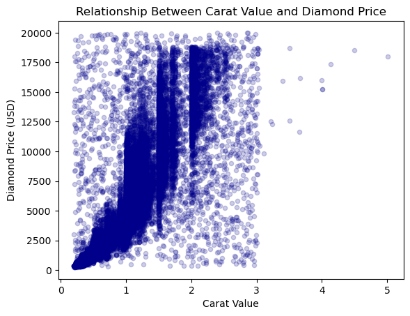
*Positive but noisy: other attributes clearly contribute to price.*

**What is the average price by cut?** Counterintuitively, Fair (the lowest grade) shows the highest average price and Ideal the lowest. This is a confound with carat, not a real pricing signal, and is the headline reason size must be controlled before judging cut.

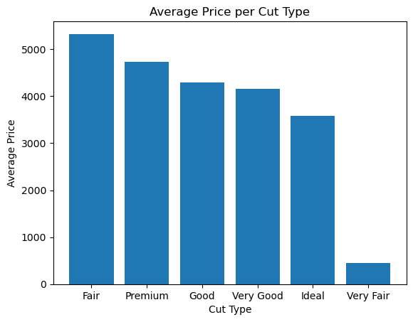
*The reversed ordering is a warning sign of a hidden variable (carat).*

**Which colours dominate inventory?** Stock concentrates in the near-colourless middle of the scale (G, E, F, H), pointing to where volume-based marketing campaigns will be most effective. Sparse grades suit scarcity-based positioning instead.

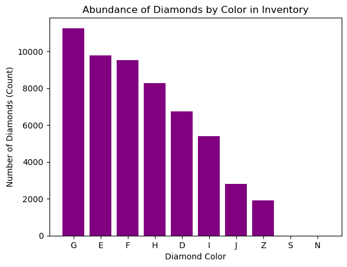
*G, E, F and H hold the bulk of inventory; S and N are effectively empty.*

**Does physical width track carat?** Strongly, along a curved relationship (weight scales with volume, roughly the cube of width). Stones sitting above the main curve carry weight in depth rather than face-up spread, a value point worth flagging to buyers.

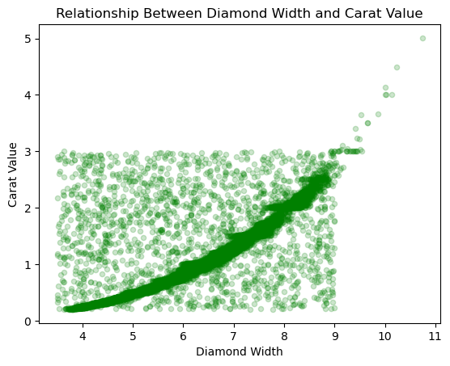
*A tight cubic curve, with a few stones carrying hidden weight in their depth.*

---

## 4. Hypothesis testing

Three t-tests were run at the 0.05 significance level:

| Test | Question | Result |
|------|----------|--------|
| One-sample | Is mean price different from 3,300 USD? | **Reject H₀** (t = -3.38, p = 0.0007). True mean sits below 3,300 USD. |
| Two-sample, two-sided | Does mean depth differ between colour D and colour J? | **Reject H₀** (t = -5.91, p ≈ 3.5 × 10⁻⁹). D diamonds have lower average depth. |
| Two-sample, one-sided | Is Very Good cut priced higher than Premium cut? | **Fail to reject H₀** (t = -7.32, p ≈ 1.0). Premium is in fact priced higher, again a carat confound. |

---

## 5. Predictive modelling

Two models were built to predict price, with categorical features one-hot encoded.

### Feature selection

A correlation matrix on the full feature set showed `x`, `y` and `z` were almost perfectly correlated with carat (they are physical dimensions of the same stone), so they were dropped in favour of carat as the single size measure.

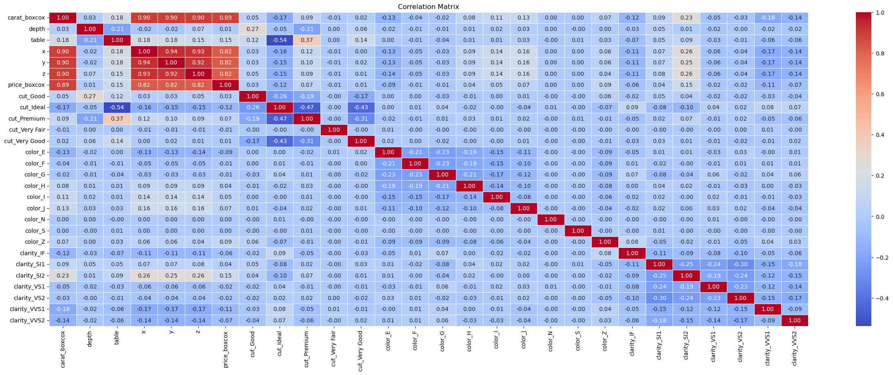
*Before: `x`, `y`, `z` and carat all carry the same size information.*

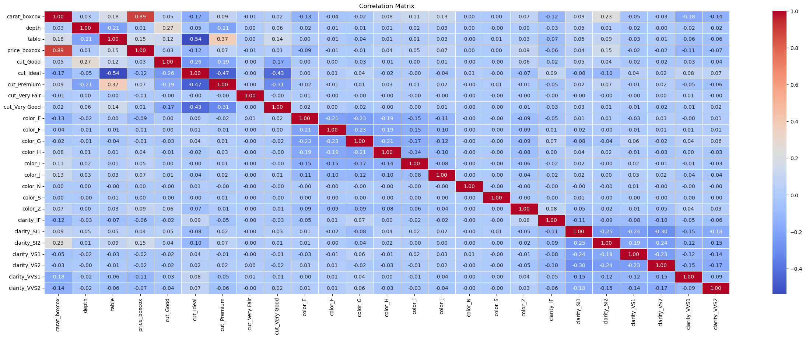
*After: redundant dimension columns removed.*

### Linear regression (OLS)

Achieved R² = 0.809 on the Box-Cox scale, with carat the dominant predictor (coefficient 1.60, t = 460) and depth insignificant (p = 0.238). Cut, colour and clarity coefficients all ordered sensibly once size was held constant, confirming the earlier confound.

Regression assumptions were then checked formally:

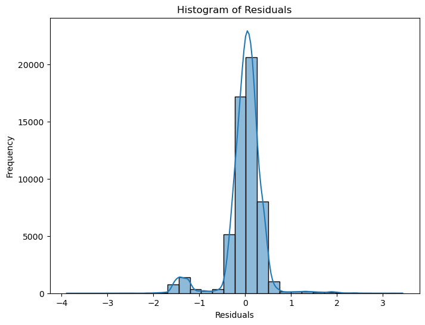
*Residuals are centred on zero and broadly symmetric, with a small secondary cluster and a slightly longer left tail.*

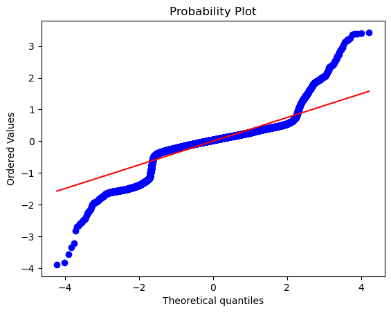
*Residuals track the normal line through the centre, with heavy tails at the extremes.*

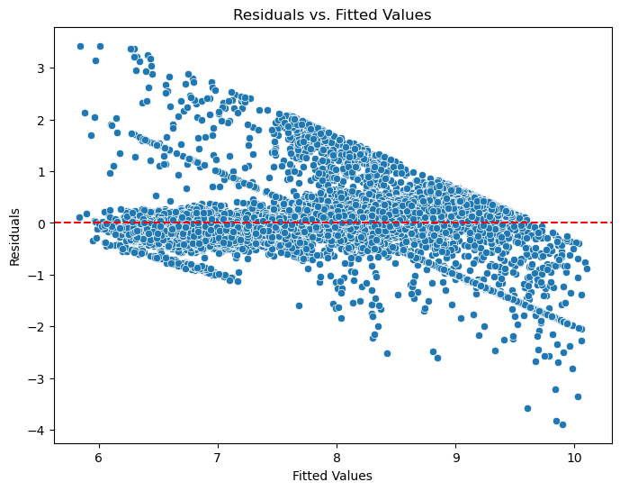
*A mild funnel shape indicates some heteroscedasticity; the Durbin-Watson statistic of 1.99 confirmed no autocorrelation.*

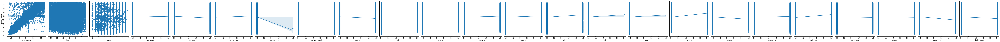
*Linearity check: carat shows a strong linear trend with price, table is weakly linear, and depth is essentially flat.*

On the held-out test set the linear model's accuracy dropped on the original dollar scale (R² = 0.47, MAPE ≈ 30%), reflecting the limits of a linear fit on a nonlinear pricing relationship.

### Random Forest regression

Trained directly on raw price with no transformation required, it captured nonlinear interactions between attributes and delivered the strongest result:

| Metric | Linear Regression (USD scale) | Random Forest (USD scale) |
|--------|------------------------------|---------------------------|
| R² | 0.47 | **0.85** |
| MAE | $1,021 | **$438** |
| RMSE | $2,059 | **$1,122** |
| MAPE | 29.95% | **15.13%** |

**Recommendation:** the Random Forest is the more reliable valuation tool for Aurora Gems, while the linear model remains useful for its interpretability of how each attribute moves price.

---

## How to run

1. Clone the repo and download the dataset (see data note below), placing it as `data.csv` in the `code/` folder.
2. Install dependencies:
   ```bash
   pip install pandas numpy scipy statsmodels scikit-learn matplotlib seaborn
   ```
3. Open `code/diamond_analytics.ipynb` in Jupyter and run all cells top to bottom. The notebook writes intermediate cleaned CSVs (`data_cleaned_missingvalues_duplicates.csv`, `data_cleaned_full.csv`) as it runs.

## Data note

The analysis uses a supplied diamonds dataset (`data.csv`) that includes deliberately introduced data-quality issues for the cleaning exercise. The raw file is not committed to this repo; the cleaning logic that produces the analysis-ready data is fully reproducible from the notebook.

**Download the dataset:** [data.csv (Google Drive)](https://drive.google.com/file/d/1aMYmVzLCaNmiyNbg5U9TwZfTGUoX2f0K/view?usp=sharing)

## Author

**Huynh Thien Luan (Ethan) Dang**
Master of Business Analytics, Macquarie University

## License

Released under the MIT License. See [LICENSE](LICENSE).
